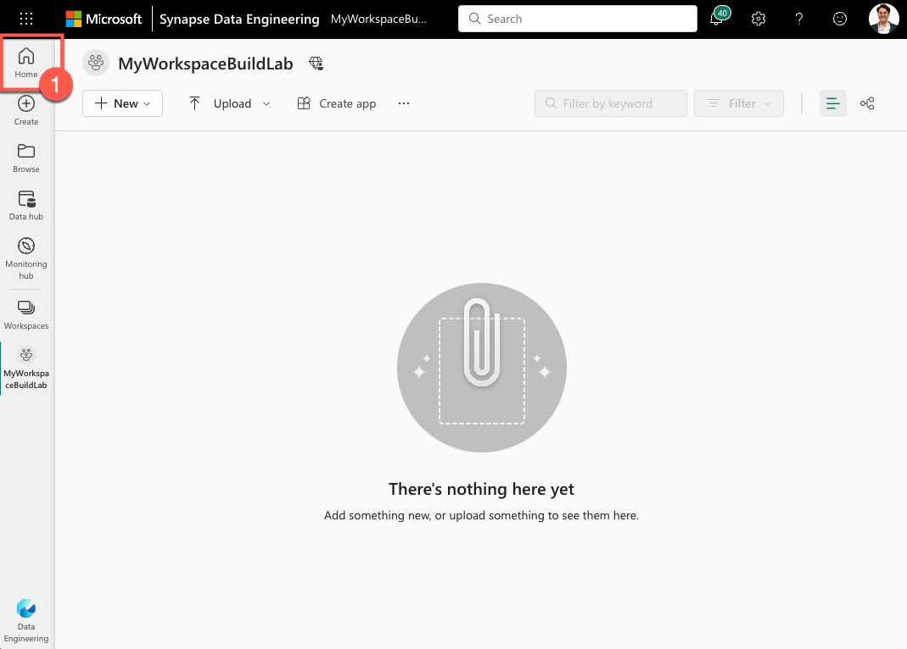
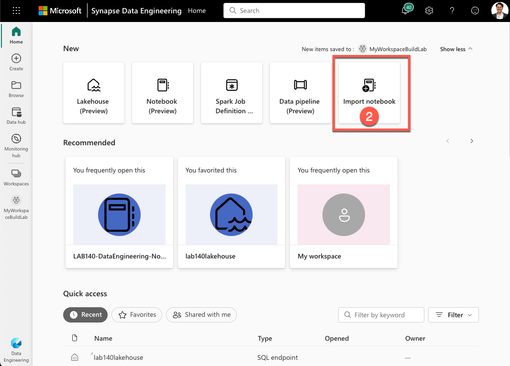
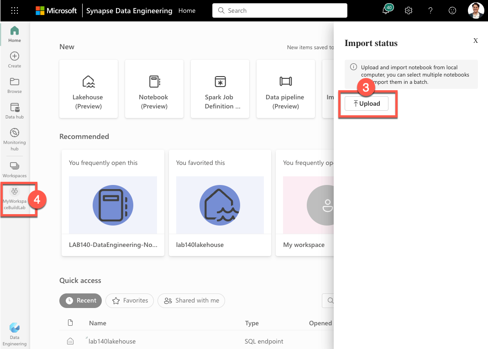
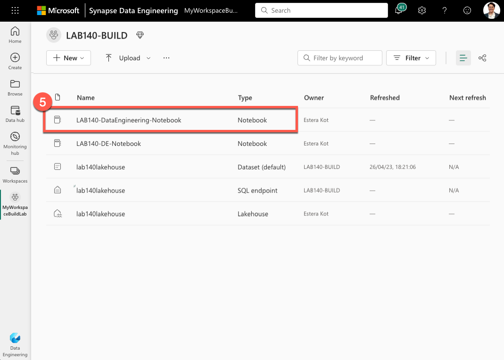

# Modern data stack in an hour

# 1. Import notebook `LAB140-DataEngineering-Notebook.ipynb` to Microsoft Fabric Data Engineering

## 1.1 Navigate to Home
Go to the home page of your Microsoft Fabric Data Engineering account.

## 1.2 "Import Notebook"
Once on the home page, click on the "Import Notebook" button.

## 1.3 "Upload" notebook

After clicking "Import Notebook," click the "Upload" button to upload the LAB140-DataEngineering-Notebook.ipynb notebook file from your computer. Once you've selected the file, navigate to your workspace to import it.

## 1.4 Open imported notebook
Once the notebook has been imported to your workspace, click on it to open it.

# 2. Follow the notebook exercises
Follow the exercises outlined in the notebook to complete the lab. You should be able to complete the exercises in around 30 minutes.
